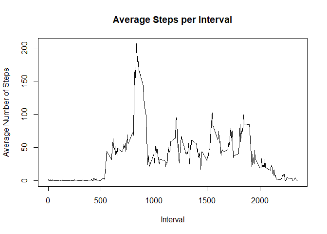

Load and process the data

    data <- read.csv("activity.csv")
    data$date <- as.Date(data$date)
    cdata <- data[!is.na(data$steps),]

Calculate the total number of steps taken per day

    sumSteps <- tapply(cdata$steps, cdata$date, sum)

Make a histogram of the total number of steps taken each day

    hist(sumSteps, xlab="Steps", main="Total Steps per Day")

Report mean and median of the total number of steps taken per day

    mean(sumSteps)

    ## [1] 10766.19

    median(sumSteps)

    ## [1] 10765

Make a time series plot of the 5-min interval and the average number of
steps

    avgSteps <- aggregate(cdata$steps, by=list(cdata$interval), FUN=mean)
    names(avgSteps) <- c("Interval", "Mean")
    plot(avgSteps$Interval, avgSteps$Mean, type="l", xlab="Interval", 
        ylab="Average Number of Steps", main="Average Steps per Interval")

Identify minute interval that contains maximum number of steps

    avgSteps[which.max(avgSteps$Mean), ]$Interval

    ## [1] 835

Calculate and report the total number of missing values in the dataset

    sum(is.na(data$steps))

    ## [1] 2304

Create a new dataset equal to original dataset with missing data filled
in

    idata <- avgSteps$Mean[match(cdata$interval, avgSteps$Interval)]
    imputedSteps <- transform(data, steps= ifelse(is.na(data$steps), yes= idata,
        no= data$steps))
    totalSteps <- aggregate(steps ~ date, imputedSteps, sum)
    names(totalSteps) <- c("Date","Steps")

Make a histogram of the total number of steps taken each day

    hist(totalSteps$Steps, xlab="Steps", main="Total Steps per day")

Report mean and median total number of steps taken per day

    mean(totalSteps$Steps)

    ## [1] 10766.19

    median(totalSteps$Steps)

    ## [1] 10766.19

Create factor variable with two levels indicating weekday or weekend day

    totSteps <- aggregate(steps ~ interval + date, imputedSteps, sum)
    totSteps$dayType <- as.factor(sapply(totSteps$date, function(x) {
        if (weekdays(x)=="Saturday" | weekdays(x)=="Sunday")
        y <- "Weekend" else
        y <- "Weekday"
        y
    }))

Make panel plot of 5-min interval & avg steps across weekday / weekend
days

    par(mfrow= c(2,1))
    with(totSteps[totSteps$dayType=="Weekend",], plot(aggregate(steps ~ interval,
        FUN=mean), type="l", main="Weekend Activity Pattern"))
    with(totSteps[totSteps$dayType=="Weekday",], plot(aggregate(steps ~ interval,
        FUN=mean), type="l", main="Weekday Activity Pattern"))

